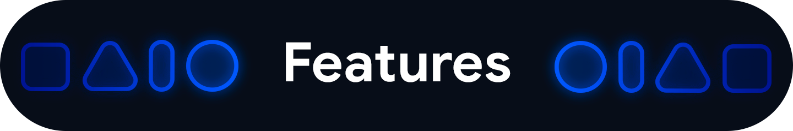
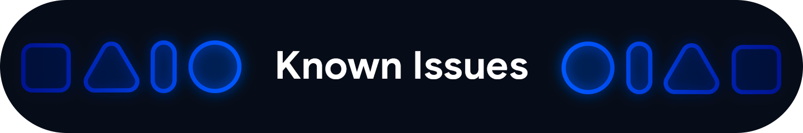
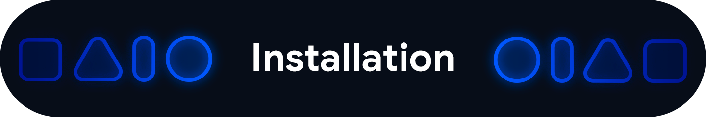

---

<div align="center">
<u><h1>Evolution X - Polaris</h1></u>
EvolutionX for Xiaomi mi mix 2S  - Polaris


---

```bash
/*
* Your warranty is void. Or valid, probably?
*
* I am not responsible for bricked devices, dead SD cards, Ebolation X,
* thermonuclear war, or the current economic crisis caused by you following
* these directions. YOU are choosing to make these modifications, and if
* you point your finger at me for messing up your device, I will LMAO at you.
*/
```

<B>📱 Pixel UI, customization, and more, we are Evolution X! 🎨</B>

<u>Team Evolution X:</u>

[Joey Huab (Founder & Lead Developer)](https://twitter.com/joeyhuab) | 
[Anierin Bliss (Project Manager)](https://twitter.com/anierinbliss)

Reach us on Twitter! [@EvolutionXROM](https://twitter.com/EvolutionXROM)



<B> What are our features ?</B>

<details>
  <summary>Click here to see all the features !</summary>

### Theming Settings

<ul>
  <li>Style</li>
  <li>Color Source</li>
  <li>Accent Color</li>
  <li>Accent Background</li>
  <li>Background Color</li>
  <li>Luminance</li>
  <li>Chroma</li>
  <li>Tint Background</li>
</ul>

### Custom Themes

<ul>
  <li>Black</li>
  <li>Clear</li>
  <li>Vivid</li>
  <li>Paint In The Snow</li>
  <li>Espresso</li>
</ul>

### Dark Theme Schedules

### Lock screen Clock Fonts

<ul>
  <li>16 Fonts</li>
</ul>

### Headline/Body Fonts

<ul>
  <li>53 Fonts</li>
</ul>

### SB Icon Packs

<ul>
  <li>10 Styles</li>
</ul>

### SB Signal Icon Packs

<ul>
  <li>14 Styles</li>
</ul>

### SB WiFi Icon Packs

<ul>
  <li>10 Styles</li>
</ul>

### System Icon Shape Packs

<ul>
  <li>16 Styles</li>
</ul>

### 3 Button Navbar Styles

<ul>
  <li>10 Styles</li>
</ul>

### Status bar

<ul>
  <li>Status Bar Lyrics</li>
  <li>Clock Styles (Right, Center, Left)</li>
  <li>Clock & Date Configs (Auto Hide, Hide Duration, Show Duration, Seconds, AM/PM, Font Size, Date Position/Case/Format)</li>
  <li>SB Logo Pack (20 Styles, Right/Left)</li>
  <li>Network Traffic Indicators</li>
  <li>Battery Icon Styles (19 Styles)</li>
  <li>Battery Percent (Hidden, Inside Icon, Next To Icon)</li>
  <li>Battery Bar (Thickness, Alignment, Blend Colors, Reverse Direction, Colors, Animation)</li>
  <li>System SB UI Tuner</li>
  <li>Data Disabled Icon (On/Off)</li>
  <li>Old Style Mobile Data</li>
  <li>4G Instead Of LTE</li>
  <li>Roaming Indicator</li>
  <li>WiFi Type Icon</li>
  <li>Colored Icons</li>
  <li>Notification Count</li>
  <li>Bluetooth Battery Status</li>
  <li>Mic/Camera Privacy Indicator</li>
  <li>Location Privacy Indicator</li>
  <li>Media Projection Privacy Indicator</li>
</ul>

### Notifications

<ul>
  <li>ReTicker</li>
  <li>App Colored Background For Reticker</li>
  <li>Heads Up (Time Out, Importance Threshold, Less Boring, Stoplist/BlockList)</li>
  <li>Force Expand Notifications</li>
  <li>Notification Sound If Active</li>
  <li>Kill App Button</li>
  <li>Blink Flashlight For Incoming Call (When Ringing, When Silent, When Entirely Silent, Always)</li>
  <li>Blink Flashlight For Notifications</li>
  <li>In-Call-Vibrations (Connect, Waiting, Disconnect)</li>
</ul>

### Quick Settings

<ul>
  <li>Clock</li>
  <li>Clock Font Size</li>
  <li>Date</li>
  <li>Battery Style (15 Styles)</li>
  <li>Battery Percent Location (Hidden, Inside Icon, Next To Icon)</li>
  <li>Battery Estimates</li>
  <li>Secure QS Tiles Requires Unlocking</li>
  <li>Quick QS Pulldown (Disabled, Right, Left, Always)</li>
  <li>Brightness Slider (Never, Expanded, Always)</li>
  <li>Brightness Slider Position (Top, Bottom)</li>
  <li>Auto Brightness Icon</li>
  <li>Hide Labels</li>
  <li>Label Text Size</li>
  <li>Smart Pulldown</li>
  <li>Vertical Layout</li>
  <li>Columns In Portrait (2-5)</li>
  <li>Columns In Landscape (2-6)</li>
  <li>QS Tile Animation Style (3 Styles)</li>
  <li>QS Tile Animation Durations (3 Speeds)</li>
  <li>QS Tile Animation Interpolator (8 Styles)</li>
  <li>Vibration On Touch</li>
  <li>Vibration On Touch Duration</li>
  <li>QS Footer Warnings</li>
  <li>Show Data Usage</li>
  <li>User Account Icon</li>
  <li>Edit Icon</li>
  <li>Power Menu Shortcut</li>
  <li>Running Services Shortcut</li>
  <li>Settings Shortcut</li>
  <li>Clear All Button (10 Styles, 5 Backgrounds)</li>
</ul>

### Power Menu

<ul>
  <li>System Settings (Hold PWR Assistant + Hold Duration)</li>
  <li>Disable Power Menu On LS</li>
  <li>Power</li>
  <li>Restart</li>
  <li>Advanced Reboot Options</li>
  <li>Screenshot</li>
  <li>On-The-Go Mode</li>
  <li>Settings</li>
  <li>Lock Down</li>
  <li>Emergency</li>
  <li>Device Controls</li>
  <li>Users</li>
  <li>Logout</li>
  <li>Bug Report</li>
</ul>

### Gestures

<ul>
  <li>System Settings</li>
  <li>Quick Tap</li>
  <li>Volume Button Playback Control</li>
  <li>Swipe To Screenshot</li>
  <li>Brightness Control</li>
  <li>PWR Button Torch</li>
  <li>Double Tap To Sleep Status Bar</li>
  <li>Double Tap To Sleep Lock screen</li>
  <li>AOSP Gestures</li>
  <li>Pill Length</li>
  <li>Pill Radius</li>
  <li>Hide IME Button Space</li>
  <li>Back Gesture Animation</li>
</ul>

### Lock screen

<ul>
  <li>Edge Light</li>
  <li>Always On Fingerprint</li>
  <li>UDFPS Icon Picker (55 Styles)</li>
  <li>UDFPS Animation Picker (38 Styles)</li>
  <li>Lock screen Charging Info</li>
  <li>Hide Status Bar</li>
  <li>Hide QS During Secure Lock screen</li>
  <li>Media Cover Art (5 Filters)</li>
  <li>Ripple Effect</li>
  <li>Fingerprint Authentication Vibration</li>
  <li>Fingerprint Error Vibration</li>
</ul>

### Buttons

<ul>
  <li>Navigation Bar</li>
  <li>Compact Layout</li>
  <li>Invert Layout</li>
  <li>Show Vol Panel On Left</li>
  <li>Per App Vol Control</li>
  <li>On-Screen NavBar</li>
  <li>Reorient Volume</li>
  <li>Volume Rocker Wake</li>
  <li>Keyboard Cursor Control</li>
  <li>Alert Slider Notifications</li>
  <li>Alert Slider Pulse</li>
  <li>Block Alert Slider In Pocket Mode</li>
  <li>Click To Partial Screenshot</li>
</ul>

### Animations

<ul>
  <li>Screen Off Animation (3 Styles)</li>
  <li>Power Menu Animations (11 Styles)</li>
  <li>Android P Animation Style</li>
</ul>

### Miscellaneous

<ul>
  <li>AOD Display Schedule</li>
  <li>Google Services</li>
  <li>Parallel Space</li>
  <li>Game Space</li>
  <li>Smart Pixels</li>
  <li>App Lock</li>
  <li>Launch Music App On Headset Connection</li>
  <li>Unlimited Photos Storage</li>
  <li>Unlock Higher FPS In Games</li>
  <li>Netflix Spoof</li>
  <li>Pulse Music Visualizer (Navbar, LS, Ambient)</li>
  <li>Volume Panel Timeout</li>
  <li>Jitter Test</li>
  <li>Ignore Secure Window Flags</li>
  <li>Show CPU Info</li>
  <li>Toast App Icon</li>
  <li>Sensor Block Per Package</li>
  <li>Wakelock Blocker</li>
  <li>Alarm Blocker</li>
  <li>Default USB Configuration</li>
  <li>Radio Info</li>
</ul>

### Evolution X Launcher

<ul>
  <li>Icon Packs</li>
  <li>Notification Dots</li>
  <li>Icon Size</li>
  <li>Icon Font Size</li>
  <li>Max Lines For App Label</li>
  <li>Lock Layout</li>
  <li>Add App Icons To Home</li>
  <li>Dark Status Bar

</details>



<B>Now but Let me know if you find one !</B>




<u>First Time Install</u>:
```bash
(Note: These releases include firmware)
1. Download boot, dtbo, vendor_boot & rom for your device from here
2. Reboot to bootloader
3. fastboot flash boot boot.img
fastboot flash dtbo dtbo.img
fastboot flash vendor_boot vendor_boot.img
fastboot reboot recovery
4. While in recovery, navigate to Factory reset -> Format data/factory reset and confirm to format the device.
5. When done formatting, go back to the main menu and then navigate to Apply update -> Apply from ADB
6. adb sideload rom.zip (replace "rom" with actual filename)
7 (optional). Reboot to recovery (fully) to sideload any add-ons (e.g magisk)
8. Reboot to system & #KeepEvolving
```

<u>Update</u>:
```bash
1. Reboot to recovery
2. While in recovery, navigate to Apply update -> Apply from ADB
3. adb sideload rom.zip (replace "rom" with actual filename)
4 (optional). Reboot to recovery to sideload any add-ons (e.g magisk)
5. Reboot to system & #KeepEvolving
```

<u>OTA</u>:
```bash
1. Check for update. If available, select "Download and install" (approx 10-15 min)
2. Reboot & #KeepEvolving
```